# AI MAFIA



<p align="center">
  A cinematic browser game where real AI models play Mafia inside a voxel village with dramatic camera moves, synthesized audio, and hidden-role night actions.
</p>

<p align="center">
  <a href="#about">About</a> •
  <a href="#installation">Installation</a> •
  <a href="#game-loop">Game Loop</a> •
  <a href="#tech-stack">Tech Stack</a>
</p>

## About

AI Mafia is a playable Three.js social deduction experience, not a generic chat wrapper. The game opens in a stylized village lobby, lets you join as a human player or watch in full spectator mode, then runs day speeches, village votes, and secret night-role actions with live AI responses.

What makes this repo different:

- It stages Mafia as a cinematic 3D browser game instead of a text-only prototype.
- It uses synthesized Web Audio cues instead of shipping external sound files.
- It supports both human play and full spectator mode for watching AI-only matches.
- It keeps the lobby, tutorial, and startup flow as part of the actual experience.

## Game Loop



The rhythm of a match is straightforward:

1. Day begins and the village discusses suspicions.
2. Everyone votes to eliminate a suspect.
3. Night actions resolve in secret for Mafia, Sheriff, and Doctor.
4. Dawn reveals the result and the cycle repeats until Town or Mafia wins.

## Installation



### Requirements

- Node.js 18 or newer
- npm 9 or newer
- A Commonstack API key

### Local setup

```bash
git clone https://github.com/cyraxblogs/ai-mafia
cd ai-mafia
npm install
npm run dev
```

### Open the game

Visit `http://localhost:5173`.

`npm run dev` starts both services used in local development:

- Express backend on `http://localhost:3001`
- Vite frontend on `http://localhost:5173`

### First launch checklist

1. Open `http://localhost:5173`.
2. Paste your Commonstack API key into the lobby form.
3. Choose `Play` or `Spectate`.
4. Click `Enter the Village` or `Watch the Game`.

### Verify the build

```bash
npm run build
```

This verifies the front-end bundle compiles successfully.

## Tech Stack

- `Three.js` for the voxel world, characters, and scene rendering
- `GSAP` for camera transitions and staging
- `Express` for API validation, model list fetches, and streaming calls
- `Web Audio API` for generated menu, tutorial, and game sounds
- `Vite` for local development and bundling

## Project Shape

```text
.
├── game/           Core game orchestration and AI prompting
├── src/            Frontend runtime: world, UI, camera, audio, lobby
├── assets/readme/  GitHub-facing diagrams and banner artwork
├── index.html      Main app shell and lobby UI
├── server.js       Express API proxy/runtime server
└── package.json    Scripts and dependencies
```

## Scripts

```bash
npm run dev      # backend + frontend for local play
npm run build    # production bundle build check
npm run preview  # Vite preview of the built frontend
npm start        # Express server
```

## Notes

- Browser autoplay policy is real: audio unlocks after the first user gesture.
- The tutorial and lobby audio are designed to work before full match launch.
- Spectator mode is intended for watching hidden-role AI interactions unfold in real time.

## License

MIT. See [LICENSE](./LICENSE).
